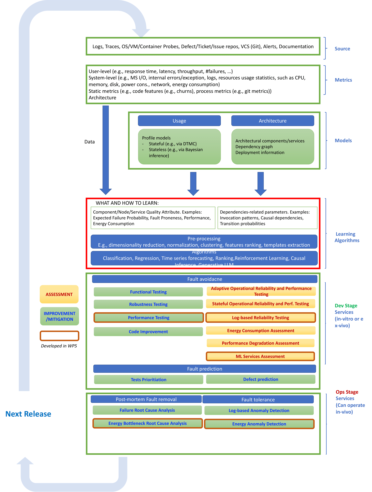

# Integrated Quality Assessment and Improvement Framework

## Overview

This repository serves as a proof of concept for the project, whos aim was to share and enhance knowledge about software quality in microservice systems through a unified view. 
The PoC integrates diverse testing techniques, facilitating both quality assessment and improvement. It leverages data from code repositories, system logs, and runtime performance metrics to support Fault Avoidance, Fault Prediction, Fault Removal, Fault Tolerance
Targeted quality attributes include Reliability, Robustness, Performance, Energy Consumption.

All developed artifacts, including code and documentation, are housed within this repository and its sub-repositories.

## Repository Structure

This repository aggregates multiple sub-repositories, each dedicated to a specific testing technique. Each sub-repository contains its own `README.md` file detailing functionality, setup instructions, and usage guidelines.

## Categories

The services are categorized based on:

1. **Stage**: Dev or Ops  
2. **Goal**: Improvement or Assessment  
3. **Scope**: Fault Avoidance, Prediction, Removal, or Tolerance  
4. **Quality Attribute**: Various quality attributes are assessed or improved

## Overview



---


## Maturity Levels

The implemented techniques vary in maturity, categorized as follows:

- **Level 1**: Fully implemented tools with user-friendly interfaces, requiring minimal effort to apply to any system under test.

- **Level 2**: Collections of scripts executable with provided prototypes; moderate effort needed to adapt to other systems.

- **Level 3**: Artifacts demonstrating usage through project-specific experiments; significant effort required to generalize.


## Services and Techniques

### Functional and Robustness Testing
- **Description**: Defect detection during unit, integration, or system testing before release.
- **Stage**: Dev  
- **Goal**: Improvement  
- **Scope**: Fault Avoidance  
- **Quality Attributes**: Functional Correctness, Robustness  
- **Internal Name**: `MacroHive`  
- **Maturity Level**: 1  
- **Link**: [MacroHive](https://github.com/uDEVOPS2020/Integrated-Quality-Assessment-and-Improvement-Framework/tree/main/MacroHive)

---

### Performance Testing
- **Description**: Critical performance configuration testing during non-functional system testing.
- **Stage**: Dev  
- **Goal**: Improvement  
- **Scope**: Fault Avoidance  
- **Quality Attribute**: Performance  
- **Internal Name**: `CallMIT`  
- **Maturity Level**: 1  
- **Link**: [CALLMIT](https://github.com/uDEVOPS2020/Integrated-Quality-Assessment-and-Improvement-Framework/tree/main/CALLMIT)

---

### Code Improvement
- **Description**: Static analysis for dead code elimination during development.
- **Stage**: Dev  
- **Goal**: Improvement  
- **Scope**: Fault Avoidance  
- **Quality Attribute**: Functional Correctness  
- **Internal Name**: `Lacuna`  
- **Maturity Level**: 1  
- **Link**: [Lacuna-evaluation](https://github.com/S2-group/Lacuna-evaluation) (original repository)

---

### Adaptive Operational Reliability Testing
- **Description**: Stateless testing using adaptive sampling on microservices’ API endpoints.
- **Stage**: Dev  
- **Goal**: Assessment  
- **Scope**: Fault Avoidance  
- **Quality Attribute**: Reliability  
- **Internal Name**: `EMART`  
- **Maturity Level**: 1  
- **Link**: [EMART](https://github.com/uDEVOPS2020/Integrated-Quality-Assessment-and-Improvement-Framework/tree/main/EMART)

---

### Stateful Operational Reliability and Performance Testing
- **Description**: Stateful technique using runtime workload replication.
- **Stage**: Dev  
- **Goal**: Assessment  
- **Scope**: Fault Avoidance  
- **Quality Attributes**: Reliability, Performance  
- **Internal Name**: `MIPaRT`  
- **Maturity Level**: 1  
- **Link**: [MIPaRT](https://github.com/uDEVOPS2020/Integrated-Quality-Assessment-and-Improvement-Framework/tree/main/MIPaRT)

---

### Log-based Reliability Testing
- **Description**: Reliability assessment and fault detection via operational logs.
- **Stage**: Dev  
- **Goal**: Assessment, Improvement  
- **Scope**: Fault Avoidance  
- **Quality Attributes**: Reliability, Functional Correctness  
- **Internal Name**: `LoMiT`  
- **Maturity Level**: 1  
- **Link**: [LoMiT](https://github.com/uDEVOPS2020/Integrated-Quality-Assessment-and-Improvement-Framework/tree/main/LoMiT)

---

### Energy Consumption Assessment
- **Description**: Analyzes energy use and performance of web apps, IoT, and monitoring tools.
- **Stage**: Dev  
- **Goal**: Assessment  
- **Scope**: Fault Avoidance  
- **Quality Attributes**: Energy, Performance  
- **Internal Name**: N/A  
- **Maturity Level**: 3  
- **Links**:  
  - [Risk Assessment Mitigation](https://github.com/uDEVOPS2020/Integrated-Quality-Assessment-and-Improvement-Framework/tree/main/Risk_Assessment_Mitigation) 
  - [ICSOC Monitoring](https://github.com/S2-group/icsoc-2023-energy-perf-monitoring-docker-rep-pkg) (original repository)

---

### ML Services Assessment
- **Description**: Accuracy assessment algorithms for ML services (image, LLMs).
- **Stage**: Dev  
- **Goal**: Assessment  
- **Scope**: Fault Avoidance  
- **Quality Attribute**: Reliability  
- **Internal Names**: `DeepSample`, `DeepSample4LLM`  
- **Maturity Level**: 2  
- **Links**:  
  - [DeepSample](https://github.com/dessertlab/DeepSample)  (original repository)
  - [OperationalTesting4LLMs](https://github.com/leanerr/OperationalTesting4LLMs) (original repository)

---

### Test Prioritization
- **Description**: Uses ML (learning-to-rank) to prioritize tests likely to expose failures.
- **Stage**: Dev  
- **Goal**: Improvement  
- **Scope**: Fault Prediction  
- **Quality Attribute**: Functional Correctness  
- **Internal Name**: `Learning-To-Rank`  
- **Maturity Level**: 2  
- **Link**: [Learning-To-Rank](https://github.com/uDEVOPS2020/Integrated-Quality-Assessment-and-Improvement-Framework/tree/main/Learning-To-Rank)

---

### Defect Prediction
- **Description**: JIT prediction of defect-prone commits using stability scores.
- **Stage**: Dev  
- **Goal**: Improvement  
- **Scope**: Fault Prediction  
- **Quality Attribute**: Functional Correctness  
- **Internal Name**: N/A  
- **Maturity Level**: 2  
- **Link**: [Defect-Prediction](https://github.com/uDEVOPS2020/Integrated-Quality-Assessment-and-Improvement-Framework/tree/main/Defect-Prediction)

---

### Failure Root Cause Analysis
- **Description**: Causal reasoning via `uKnows` to identify responsible microservices.
- **Stage**: Ops  
- **Goal**: Improvement  
- **Scope**: Fault Removal  
- **Internal Name**: `uKnows`  
- **Maturity Level**: 2  
- **Link**: [uKnows](https://github.com/uDEVOPS2020/Integrated-Quality-Assessment-and-Improvement-Framework/tree/main/MacroHive/uKnows)

---

### Log-based Anomaly Detection
- **Description**: Converts log data into numeric features for ML-based anomaly detection.
- **Stage**: Ops  
- **Goal**: Improvement  
- **Scope**: Fault Tolerance  
- **Quality Attribute**: Reliability  
- **Internal Name**: `Micro2vec`  
- **Maturity Level**: 1  
- **Link**: [Micro2vec](https://github.com/uDEVOPS2020/Integrated-Quality-Assessment-and-Improvement-Framework/tree/main/Micro2vec)

---

### Energy Anomaly Detection
- **Description**: Detects energy bottlenecks in microservice systems.
- **Stage**: Ops  
- **Goal**: Improvement  
- **Scope**: Fault Tolerance  
- **Quality Attribute**: Energy  
- **Internal Name**: N/A  
- **Maturity Level**: 2  
- **Links**:  
  - [Repo 1](https://github.com/uDEVOPS2020/Integrated-Quality-Assessment-and-Improvement-Framework/tree/main/Multivariate-AD-and-RCA-of-Energy-Issues-in-Microservice-based-Systems)  
  - [Repo 2](https://github.com/uDEVOPS2020/Integrated-Quality-Assessment-and-Improvement-Framework/tree/main/Anomaly-Detection-and-Root-Cause-Analysis-of-Microservices-Energy-Consumption)

---

### Energy Root Cause Analysis
- **Description**: Identifies services responsible for energy issues.
- **Stage**: Ops  
- **Goal**: Improvement  
- **Scope**: Fault Tolerance  
- **Quality Attribute**: Energy  
- **Internal Name**: N/A  
- **Maturity Level**: 2  
- **Links**:  
  - [Repo 1](https://github.com/uDEVOPS2020/Integrated-Quality-Assessment-and-Improvement-Framework/tree/main/Multivariate-AD-and-RCA-of-Energy-Issues-in-Microservice-based-Systems)  
  - [Repo 2](https://github.com/uDEVOPS2020/Integrated-Quality-Assessment-and-Improvement-Framework/tree/main/Anomaly-Detection-and-Root-Cause-Analysis-of-Microservices-Energy-Consumption)


## Getting Started

1. **Clone the Repository**:
   ```bash
   git clone https://github.com/uDEVOPS2020/uDEVOPS2020.git
   cd uDEVOPS2020
   ```

2. **Explore Sub-Repositories**:
   Navigate to each sub-repository to understand specific testing techniques and their applications.

3. **Follow Setup Instructions**:
   Each sub-repository provides detailed setup and usage instructions in its `README.md`.

## Contributing

Contributions are welcome to enhance the framework's capabilities. Please follow these steps:

1. **Fork the Repository**: Create your own fork to propose changes.

2. **Create a Feature Branch**:
   ```bash
   git checkout -b feature/YourFeature
   ```

3. **Commit Your Changes**:
   ```bash
   git commit -m "Add YourFeature"
   ```

4. **Push to Your Fork**:
   ```bash
   git push origin feature/YourFeature
   ```

5. **Submit a Pull Request**: Detail your changes and their purpose.

## License

This project is licensed under the [MIT License](LICENSE).

## Contact

For inquiries or support, please contact the project coordinator:

- **Name**: Roberto Pietrantuono, University of Naples Federico II
- **Email**: roberto.pietrantuono@unina.it
